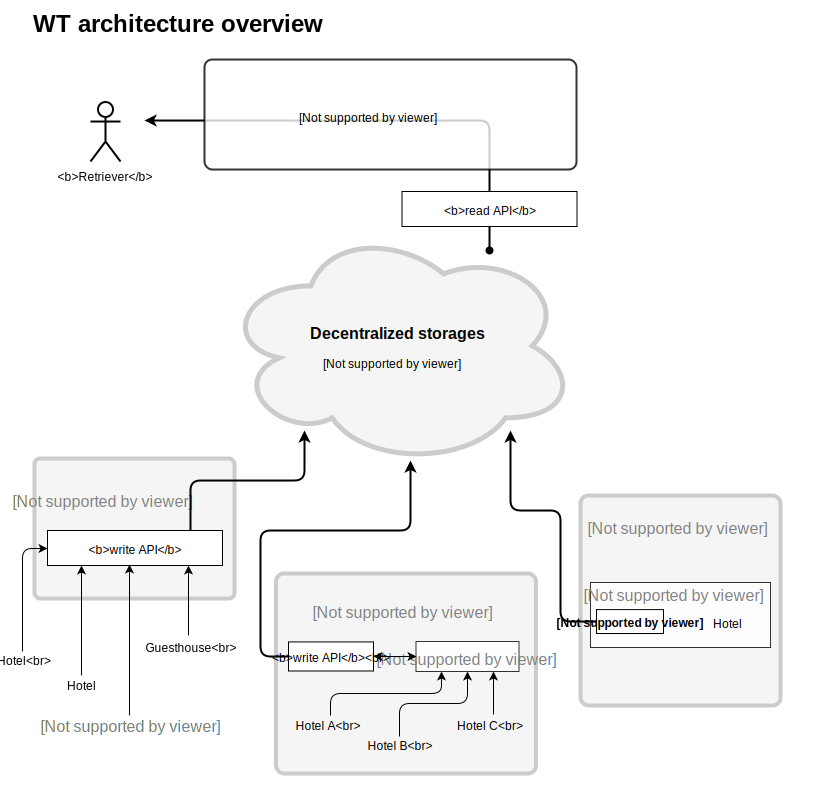

# WT Hotel Architecture

This document describes a high level design of the Winding Tree (WT) hotel inventory distribution platform (WT).

## Technologies used

### Ethereum Blockchain

We are using blockchain to store public **index of hotels** - a decentralized entry point to the Winding Tree data.

We have choosen Ethereum for the index, because it adds a possiblity to write full-fledged applications directly on top of it. This allows us fine tune of permitions and rules for hotel listing management.

### Distributed storage

All data except Winding Tree Index are stored on Distributed Storages of choice of the data provider. Every hotel registered in the Winding Tree Index has it's own smart contract representing it. The smart contract contains (beside other) uri pointing to a hotel data file in JSON format. We are currently supporting HTTPs and [Swarm](http://swarm-guide.readthedocs.io/en/latest/introduction.html) as the protocol of the data storage.

Why we decided to use off-chain storage? Blockchain is a distributed storage but with added immutable history and the associated costs per operation and data stored. Storing hotel data (like title or a textual description) on blockchain is too expensive and adds no benefit if we don't need immutable history.

## Architecture diagram

## The operations on WT

0) Register and manage a hotel and inventory
1) Get list of existing hotels (index)
2) Get details (description, pictures, ...)
3) List inventory (rooms, services, ...)
4) Search data by attributes
5) Get current availability/price
6) Book
7) Pay (not designed yet)

### 0 - Register and manage a hotel and inventory

*We build a [wt-write-api](https://github.com/windingtree/wt-write-api) to make this process more convenient.*

Hotel registration consists of these steps
- select an [update-API](https://github.com/windingtree/wt-update-api) server
- publish hotel data (description, location, uri of the registered [update API] server, room types, rate plans, ...) in a [specific format] on a HTTPs or [Swarm](http://swarm-guide.readthedocs.io/en/latest/introduction.html) address.
- register the hotel in [Winding Tree Index] with the uri of the published hotel data.

Hotel data modification steps
- update the data on distributed storage
- notify selected [udpate-API] server about the data change

### 1-3,5 - List of existing hotels, inventory, availability and price

To list hotels 

- Call [Winding Tree Index](https://github.com/windingtree/wt-contracts/blob/master/contracts/WTIndex.sol) smart contract's list method getHotes() which returns list of addresses of all [smart contracts of hotels](https://github.com/windingtree/wt-contracts/blob/master/contracts/hotel/Hotel.sol) registered on [WTIndex](https://github.com/windingtree/wt-contracts/blob/master/contracts/WTIndex.sol).
- For each hotel read the [Hotel data index](https://windingtree.github.io/docs/swagger-ui/) stored on `dataUri` property of hotel's smart contract.
- The [Hotel data index](https://windingtree.github.io/docs/swagger-ui/) contains links to all the informations about hotel, namely
-- descriptionUri - uri of the description json file holding basic information about hotel like name, basic text description, contacts, geographical location, images urls, ... 
-- ratePlansUri - uri of ratePlans description file well rate plans (prices)
-- availabilityUri - uri of availability file
-- notificationsUri - uri of [Notification server (wt-updata-api)](https://github.com/windingtree/wt-update-api) this hotel uses to notify about changes in data (availability, prices, other)
-- bookingUri - uri to the hotel's booking API endpoint (see *6 - Book* below)

### 6 - Book
Hotel publishes bookingUri as part of it's [Hotel data index](https://windingtree.github.io/docs/swagger-ui/)  of endpoint on which the hotel accepts online reservations in [standardized protocol](https://windingtree.github.io/docs/swagger-ui/booking-api.html#/default/post_booking). If this uri is empty, the hotel does not have an automated reservation gateway, booking is possible using published contact information.

### 7 - Pay
Supported payment methods are yet to be defined. Most bookings are payed at the time of arrival for non-business custommers and also payment information can be part of hotel's response to booking request (see *6 - Book* chapter above)

### Distribution Steps

1. Hotel signs its data in a readable standardized format and publishes them to a D-DB or any other storage solution they want to use.
2. Hotel writes url-pointers to blockchain together with his address/es and basic information
3. OTAs and Hotel APIs access all WT inventory through a WT Node and expose it to the final user.

### Properties of the system

- **Open Source**, anyone can run their own WT-Node.
- **Open API**, WT will provide public nodes for easy access to the network.
- **Open Data**, all the information about the inventory is public, anyone can access it.
- **Cryptographically Verified**, all the information is signed by their owners, making it easy to verify the authenticity of the data.
- **Ownership**, the hotels will have the complete ownership of their inventory and bookings.

### Availability / Prices / Content

The hotel smart contracts will have urls for the avaliability, price and media content. We will support any protocol like bzz, ipfs, https.

Keeping track of changes of availability and price by polling the data files of all hotels for changes is possible but could spend unnecessarily high amount of resources on client as well as D-DB. It is desirable to implement event based tracking of changes where the hotels might actively push changes of their inventory to WT network.

The WT-Cache will listen for any change that happens on the Blockchain and the Distributed-DB. The cache will expose a public database where any search query can be done.

The data provided will have to follow a standard, the standard will be proposed by Winding Tree but it will be governed using a simple multisignature wallet os a simple governance system not related to the Lif token.

### Booking / Payment

1) Client selects a pack of services, adds price and any contract details to one document.
2) The hotel owner of that services signs the document confirming that they want to make this contract, and send the signature to the user.
3) The user makes the payment. The payment methods and currencies accepted will be decided by the hotel, WT will provide solutions for using Lif token as payment by default but is not enforced, any other payment like credit cards or bank transfers can be used as well.
4) The booking tx gets executed on WT verifying the signed message sent by the hotel owner in step two.

## Authors

- Robin Gottfried
- [Jiří Chadima](https://github.com/jirkachadima) (<jiri.chadima@fragaria.cz>)
- Martin Bílek
- [Augusto Lemble](https://github.com/AugustoL) (<augusto@windingtree.com>)
- [Jakub Vysoky](https://github.com/kvbik) (<jakub@windingtree.com>)
