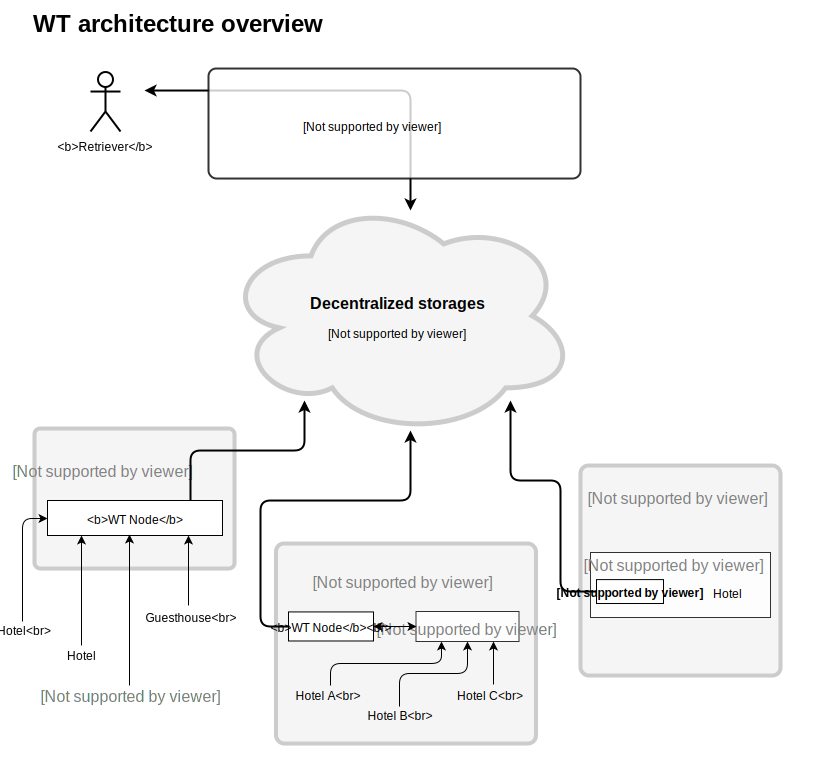

# WT Hotel Architecture

This document describes a high level design of the network for hotel inventory distribution that will be developed by Winding Tree (WT). This is not to be considered how the final architecture of the platform will be, this document only presents the first iteration of the solution to a lot of problems that we've identified in the hotel travel industry.

### Blockchain

Blockchain is the only technology which is able to keep immutable shared history in the IT world. This ability is paid for by high cost of any operation and data storage on a blockchain as each node in the network needs to repeat any operation requested on respective blockchain and keep all data forever.

WT will use the Ethereum network, the main difference to Bitcoin is that Ethereum is [Turing complete](https://en.wikipedia.org/wiki/Turing_completeness), which means that we can write more complex applications on top of it and store more information on chain (inside the blockchain).

We will use the Ethereum blockchain to store a list of all hotels registered in WT, this information is open to the public.

### Distributed Database (D-DB)

A distributed database is a network system where the data is spread across nodes in a manner that a requester can contact any node to successfully receive the content associated with a key. The database keeps running even when most of the network nodes disappear. Examples of such database are [IPFS](https://ipfs.io/) or [Swarm](http://swarm-guide.readthedocs.io/en/latest/introduction.html).

Blockchain is a distributed database but with added immutable history and the associated costs per operation and data stored, storing data on the blockchain is too expensive (for now), so we've decided to use a distributed storage in the beginning till the blockchain network is scalable and efficient enough to store data on it.

Each hotel in WT will have a file in a distributed database where all the content, availability and prices will be hosted and open to the public. It is possible that we will choose different distributed databases for different kinds of content.

## The operations on WT

1) Get list of existing hotels (index)
2) Get details (description, pictures, ...)
3) List inventory (rooms, services, ...)
4) Search data by attributes
5) Get current availability/price
6) Book
7) Pay

## Overview

### Distribution Steps

1. Hotel signs its data in a readable standardized format and publishes them to a D-DB or any other storage solution they want to use.
2. Hotel writes url-pointers to blockchain together with his address/es and basic information
3. OTAs and Hotel APIs access all WT inventory through a WT Node and expose it to the final user.

### Properties of the system

- **Open Source**, anyone can run their own WT-Node.
- **Open API**, WT will provide public nodes for easy access to the network.
- **Open Data**, all the information about the inventory is public, anyone can access it.
- **Cryptographically Verified**, all the information is signed by their owners, making it easy to verify the authenticity of the data.
- **Ownership**, the hotels will have the complete ownership of their inventory and bookings.

### Availability / Prices / Content

The hotel smart contracts will have urls for the avaliability, price and media content. We will support any protocol like bzz, ipfs, https.

Keeping track of changes of availability and price by polling the data files of all hotels for changes is possible but could spend unnecessarily high amount of resources on client as well as D-DB. It is desirable to implement event based tracking of changes where the hotels might actively push changes of their inventory to WT network.

The WT-Cache will listen for any change that happens on the Blockchain and the Distributed-DB. The cache will expose a public database where any search query can be done.

The data provided will have to follow a standard, the standard will be proposed by Winding Tree but it will be governed using a simple multisignature wallet os a simple governance system not related to the Lif token.

### Booking / Payment

1) Client selects a pack of services, adds price and any contract details to one document.
2) The hotel owner of that services signs the document confirming that they want to make this contract, and send the signature to the user.
3) The user makes the payment. The payment methods and currencies accepted will be decided by the hotel, WT will provide solutions for using Lif token as payment by default but is not enforced, any other payment like credit cards or bank transfers can be used as well.
4) The booking tx gets executed on WT verifying the signed message sent by the hotel owner in step two.

## Authors

- Robin Gottfried
- [Jiří Chadima](https://github.com/jirkachadima) (<jiri.chadima@fragaria.cz>)
- Martin Bílek
- [Augusto Lemble](https://github.com/AugustoL) (<augusto@windingtree.com>)
- [Jakub Vysoky](https://github.com/kvbik) (<jakub@windingtree.com>)
